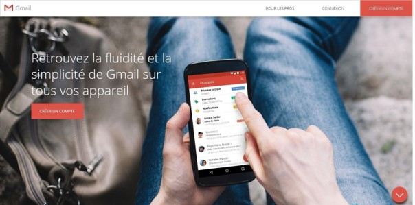
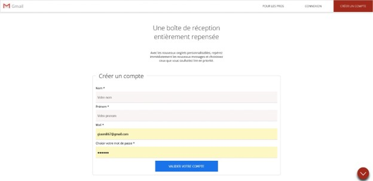

# Bienvenue sur le Projet FAKE GMAIL

## 🌐 Visitez Le Projet: [Projet gmail](https://prostony.github.io/gmail_fake/)

## Acceuil

## Creation de Compte

## Connexion à un compte

## 🌟 Présentation

Ceci est un projet réaliser durant mon année de BTS SIO en 2 ème année. Le but etait de reproduire la page de Gmail.

## 🚀 Technologies Utilisées

Mon portfolio est construit avec les technologies les plus innovantes du moment. Voici quelques-unes des technologies que j'ai utilisées :

- **HTML :**Langage pour structurer et afficher contenu web.
- **CSS :**CSS (Cascading Style Sheets) est utilisé pour styliser et mettre en forme les pages web.
- **PHP :**Langage de programmation côté serveur pour sites web dynamiques.
- **JAVASCRIPT :**Langage de programmation côté client pour interactivité sur les pages web.
- **GitHub Pages :**Pour héberger ce portfolio de manière simple et gratuite.

- **Email :** [obiangprostony1@gmail.com](mailto:obiangprostony1@gmail.com)
- **LinkedIn :** [obiang essone prossotny](https://www.linkedin.com/mynetwork/)
